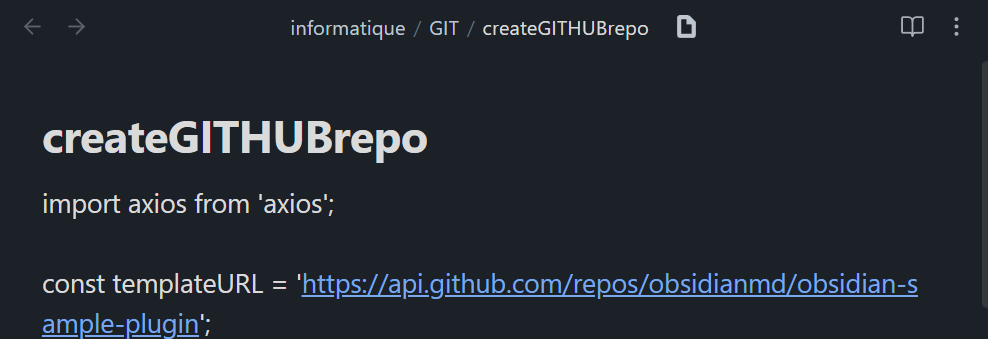
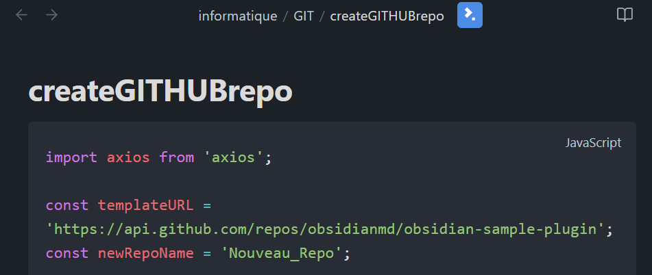

# Extra Extensions

This plugin allows opening non-markdown extensions, such as:
- *.js
- *.ts
- *.c
- ...

An icon appears at the top, next to the title.
Clicking it toggles the document between CODE BLOCK VIEW (with syntax highlighting) and the initial state.
You can customize which file extensions are supported by adding more extensions in the plugin settings, associated with language used in code block view to have syntax highlighting.

## Managing Extensions

### Adding/Editing Extensions
You can add/edit new extension mappings in several ways:
- **Settings Tab**: Go to plugin settings to manage all extensions
- **Command Palette**: Use the "Add Extension Mapping" command
You can enter new extensions and associated code block language doing: 
`py:python,...` or `,ts,...` (same extension and language format)

## Development

This plugin uses a template that automates the development and publication processes on GitHub, including releases.  
You can develop inside .obsidian>plugins folder or from another folder.  
Important: if you develop from another folder, you need to fill the `.env` file with the paths to your vaults.

### Environment Setup

#### File Structure

- `main.ts` must in the src folder
- `styles.css` can be in the src folder or root folder

#### Development Options

0. **First install yarn:** `npm install -g yarn`

1. **Inside the vault's plugins folder:**
   - Delete the `.env` file or put empty paths.

2. **From another folder:**
   - Set the vault paths in the `.env` file:
     - `TestVault` for development
     - `RealVault` for production simulation
   - Necessary files will be automatically copied to the targeted vault

### Available Commands

- `yarn start`: Opens VS Code, runs `yarn install`, then `yarn dev`
- `yarn dev`: For development
- `yarn build`: Builds the project
- `yarn real`: Simulates a traditional plugin installation in your REAL vault
- `yarn bacp`: Builds, adds, commits, and pushes (prompts for commit message)
- `yarn acp`: Adds, commits, and pushes (without building)
- `yarn version`: Updates version, modifies relevant files, then adds, commits, and pushes
- `yarn release`: Creates a GitHub release (prompts for release title, can be multiline using `\n`)
- `yarn lint`: Lints the project
- `yarn lint:fix`: Fixes linting issues

### Recommended Workflow

1. `yarn start`
2. `yarn bacp`
3. `yarn version`
4. `yarn release`

### Additional Features

- **obsidian-typings**: This template automatically includes obsidian-typings, providing access to additional types not present in the official API.